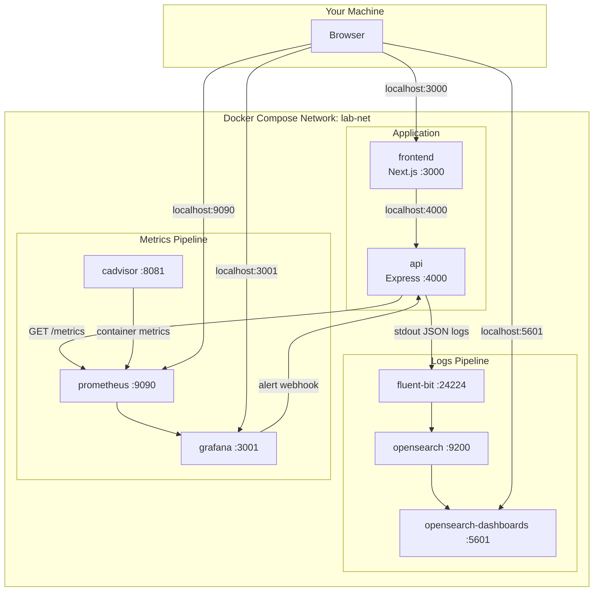
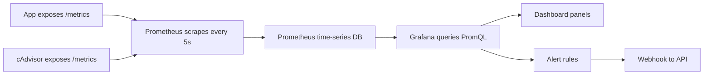

# Architecture

## Full system

## What happens when you click "Flaky request"

This is the end-to-end flow through every container:

1. **Browser** sends `GET http://localhost:4000/api/error` to the API.
2. **api** container: Express handler runs. ~30% of the time it returns 500 and `pino` writes a structured JSON log line to stdout with `level:error`, `route:/api/error`, `status:500`.
3. **api** container: Docker's `fluentd` logging driver pushes the log line to Fluent Bit at `localhost:24224`.
4. **fluent-bit** container: receives the log, parses the JSON inside the `log` field, and writes it to OpenSearch as a document in index `app-logs-2026.06.10`.
5. **opensearch** container: stores the document and makes it searchable.
6. **opensearch-dashboards** container: queries OpenSearch when you open Discover and shows the log line.
7. **api** container: the metrics middleware increments `http_requests_total{route="/api/error", status="500"}` and records duration in the histogram.
8. **prometheus** container: scrapes `http://api:4000/metrics` every 5 seconds and stores the new counter/histogram values.
9. **cadvisor** container: independently reports container CPU/memory metrics to Prometheus.
10. **grafana** container: queries Prometheus, updates the error-rate panel, and evaluates alert rules. If error rate > 5% for 1 minute, it fires the "High request error rate" alert.
11. **grafana** sends a webhook `POST` to `http://api:4000/alert-hook`.
12. **api** logs the alert payload — which goes back through steps 3–6, so the alert itself becomes a searchable log in OpenSearch.

## Logs pipeline (push model)

**Key idea:** the application never talks to OpenSearch directly. It just prints logs. A separate shipper (Fluent Bit) collects and forwards them. This is the standard production pattern.

## Metrics pipeline (pull model)

**Key idea:** Prometheus pulls metrics from your app on a schedule. Your app doesn't push metrics anywhere — it just exposes them and waits to be scraped.

## Container map

| Container | Image | Port (host) | Role |
|-----------|-------|-------------|------|
| frontend | opensearch-lab-frontend | 3000 | Next.js UI |
| api | opensearch-lab-api | 4000 | Express API + instrumentation |
| fluent-bit | fluent/fluent-bit:3.2 | 24224 | Log collection and forwarding |
| opensearch | opensearchproject/opensearch:2.19.1 | 9200 | Log storage and search |
| opensearch-dashboards | opensearchproject/opensearch-dashboards:2.19.1 | 5601 | Log visualization |
| prometheus | prom/prometheus:v2.53.0 | 9090 | Metrics storage |
| cadvisor | gcr.io/cadvisor/cadvisor:v0.49.1 | 8081 | Container resource metrics |
| grafana | grafana/grafana:11.6.1 | 3001 | Metrics dashboards + alerts |
